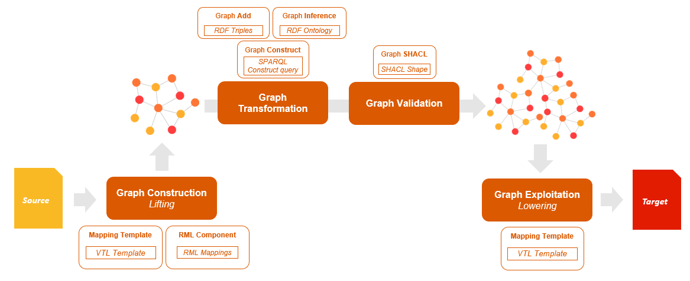

_Chimera_: Composable Semantic Data Transformation
===
Chimera is a tool offering building blocks to compose conversion pipelines based on Semantic Web solutions and implemented on top of [Apache Camel](https://camel.apache.org/).

### Goals
The motivating scenario is about many stakeholders with an interoperability need. To avoid the definition of point-to-point conversions, an **any-to-one centralized mapping approach** based on Semantic Web technologies (and a reference ontology used as global conceptual model) offers the following advantages:

- Let stakeholders keep using their current legacy systems
- To obtain interoperability with other actors in the ecosystem, a stakeholder only needs to define **lifting** mappings from the adopted standard to the reference ontology, and **lowering** mappings from the reference ontology to the standard
- **Knowledge graph** as an additional valuable product of the conversion

The main goal of Chimera is to facilitate the definition of conversion pipelines in the described scenario. In particular, the main objectives are:

* to enable the definition of so-called _semantic conversion pipelines_ (using Semantic Web-based solutions for data transformation) to obtain message-to-message mediators or batch converters;
* to minimise the amount of code to be written, in principle, the aim is to completely avoid coding by just configuring the various components provided.

### Architecture
The main assumption of Chimera is that it is possible to break down a converter (or mediator, using the naming conventions specific to Enterprise Service Buses) into smaller, composable and reusable entities. The inspiration to this approach is taken from the Enterprise Integration Patterns, breaking a data-based process into blocks to be composed, that are implemented in Apache Camel. Chimera provides additional blocks for the Apache Camel framework enabling the reuse of production-ready Camel components already defined (e.g., integration with input/sink data sources) and/or the implementation of additional blocks (e.g., custom pre-processing).

The architecture of Chimera is heavily inspired by the Enterprise Integration Pattern [Content Enricher](https://www.enterpriseintegrationpatterns.com/patterns/messaging/DataEnricher.html). The RDF graph can be interpreted as a variable which is shared among all the blocks in a conversion process. A basic conversion process based on Semantic Web technologies generates triples from the incoming message/dataset (lifting) and uses the resulting graph to extract data which is used to populate the structure of the destination message/dataset (lowering). Furthermore, the conversion can require enrichment with some background knowledge (being either a set of ontologies or a set of master/lookup data).

With this high-level process in mind, we defined a core set of blocks:

* _Lifting_: this block takes a structured message as input, and enriches the RDF graph with the triples obtained by applying a "mapping" to the input.
* _Data enricher_: this block loads a set of RDF files, or generates a set of triples (e.g. CONSTRUCT queries) and loads them into the RDF graph.
* _Inference enricher_: this block loads a set of ontology files into the RDF graph, inference rules can generate additional triples enriching the graph.
* _Lowering_: this block applies a “mapping” to data extracted from the RDF graph, and produces a structured message as output.

<p align="left"></p>

Chimera contains a default implementation for the mentioned blocks, plus additional _utilities_ blocks to configure a semantic conversion pipeline. Each module is decoupled from the others providing high flexibility in configuring pipelines for different requirements.

### Project structure
The project has a parent POM (in the parent directory) that can be used to trigger the Maven builds of sub-projects respecting internal dependencies. You can modify the parent POM to select only sub-projects you are interested in.
The main sub-project is `chimera-core` that contains the basic blocks of the Chimera framework. The [rdf4j](https://rdf4j.org/) library is used to handle the RDF graph in all the pipeline blocks. Additional blocks can be found in the other sub-projects:

- `chimera-rml` contains the blocks to implement lifting using the [rml-mapper](https://github.com/cefriel/rmlmapper-cefriel) library 
    - This sub-project depends on the mentioned library that is imported as a git submodule in `libs/rmlmapper-cefriel`
- `chimera-rdf-lowerer` contains the blocks to implement lowering using the [rdf-lowerer](https://github.com/cefriel/rdf-lowerer) library 
    - This sub-project depends on the mentioned library that is imported as a git submodule in `libs/rdf-lowerer`
- `chimera-records` contains a set of utility blocks to gather data (timestamps, RDF graph data,...)  within a Chimera pipeline

Last but not least, the `chimera-example` provides an example of conversion pipeline implemented configuring the different blocks with a [Spring XML Camel Context](https://camel.apache.org/components/latest/spring-summary.html). Complete instructions to run the example below, additional options to deploy and customize the `chimera-example` can be found in `chimera-example/README.md`.

### How to run it
- Clone the repository and the required git submodules
    ```
    git clone --recurse-submodules https://github.com/cefriel/chimera.git
    ```
- Remove comments from the parent `pom.xml` if required libraries (git submodules) are not already installed in the local Maven repository
- Run `mvn:install` in the root folder to build all the sub-projects and libraries
- Build the chimera-example image
    ```
    cd chimera-example && docker build --no-cache -t chimera-example .
    ```
- Run the `chimera-example` container
    ```
    docker run -p 8888:8888 chimera-example
    ```

### How to test it

The  `chimera-example`  defines a conversion pipeline, exposed through an API, and considering a sample [GTFS](https://developers.google.com/transit/gtfs) feed as input and the [Linked GTFS](https://github.com/OpenTransport/linked-gtfs) vocabulary as the reference ontology.

- Use the _RML lifter_ block to obtain a Linked GTFS representation of the `stops.txt` file in the sample GTFS feed.
  
    ```
    POST http://localhost:8888/chimera-demo/lift/gtfs/ 
    Attach the file chimera-example/inbox/sample-gtfs-feed.zip
    ```
    
- Use the _RML lifter_ block and the _rdf-lowerer_ block to obtain back a GTFS representation of the `stops.txt` file in the sample GTFS feed after a roundtrip through a Linked GTFS representation.
    ```
    POST http://localhost:8888/chimera-demo/roundtrip/gtfs/ 
    Attach the file chimera-example/inbox/sample-gtfs-feed.zip
    ```
    
- Use the _RML lifter_ block and the _rdf-lowerer_ block to obtain back an _enriched_ GTFS representation of a sample GTFS feed after a roundtrip through a Linked GTFS representation. In this example, we use the example data in `chimera-example/src/main/resources/enrich.ttl`.
    ```
    POST http://localhost:8888/chimera-demo/roundtrip/gtfs/ 
    Attach the file chimera-example/inbox/sample-gtfs-feed.zip
    Add as header additional_source:enrich.ttl
    ```
    You can also use a different additional source using two steps:

    1. Load an additional source
        ```
        POST http://localhost:8888/chimera-demo/load/ 
        For example, attach the file chimera-example/inbox/mysource.ttl
        Add as header filename:my-source.ttl
        ```
    2. Perform the enriched conversion
        ```
        POST http://localhost:8888/chimera-demo/roundtrip/gtfs/ 
        Attach the file chimera-example/inbox/sample-gtfs-feed.zip
        Add as header additional_source:my-source.ttl
        ```
    
- Use the _RML lifter_ block and the _rdf-lowerer_ block to obtain back an _enriched_ GTFS representation of a sample GTFS feed after a roundtrip through a Linked GTFS representation and enabling RDFS inference. In this example, we use an example ontology (`chimera-example/src/main/resources/ontology.owl`) defining an axiom for the definition of a `range` on the `gtfs:parentStation` property. Using the enricher block with data in the additional source, and enabling inference with that ontology, we can retrieve an additional `gtfs:Stop` in the lowering of the `stops.txt` file.
    ```
    POST http://localhost:8888/chimera-demo/roundtrip/gtfs/ 
    Attach the file chimera-example/inbox/sample-gtfs-feed.zip
    Add as header 
        additional_source:enrich.ttl
        inference:true
    ```
    **Note** The `InferenceEnricher` block enabled in this pipeline performs a one-time inference evaluation against the schema adding the resulting triples to the graph. To improve performances and guarantee inference throughout the entire pipeline, it is recommended to configure the `AttachGraph` block (a _commented_ example can be found in the `.xml` file of the route).
- Use the _RML lifter_ block and the _rdf-lowerer_ block to obtain back an _enriched_ GTFS representation of a sample GTFS feed after a roundtrip through a Linked GTFS representation and downloading the additional source from a server requiring _JWT based authentication_. To run this example you need to configure the authorization server URL in the chimera pipeline (`chimera-example/src/main/resources/routes/camel-context.xml`)
    - Perform the enriched conversion
        ```
        POST http://localhost:8888/chimera-demo/roundtrip/gtfs/ 
        Attach the file chimera-example/inbox/sample-gtfs-feed.zip
        Add as header 
            additional_source:<url_server_source>
            username:<server_username>
            password:<server_password>
        ```
    
- Enrichment and Inference can also be applied using the same headers to the lifting route (http://localhost:8888/chimera-demo/lift/gtfs/)

### References

Projects using Chimera:

- SNAP: Seamless exchange of multi-modal transport data for transition to National Access Points https://snap-project.eu/
- SPRINT: Semantics for PerfoRmant and scalable INteroperability of multimodal Transport http://sprint-transport.eu/

Publications:
- `Scrocca M., Comerio M., Carenini A., Celino I. (2020) Turning Transport Data to Comply with EU Standards While Enabling a Multimodal Transport Knowledge Graph. In: The Semantic Web – ISWC 2020. Springer. https://doi.org/10.1007/978-3-030-62466-8_26`

### License

_Copyright 2020 Cefriel._

Licensed under the Apache License, Version 2.0 (the "License");
you may not use this file except in compliance with the License.
You may obtain a copy of the License at

    http://www.apache.org/licenses/LICENSE-2.0

Unless required by applicable law or agreed to in writing, software
distributed under the License is distributed on an "AS IS" BASIS,
WITHOUT WARRANTIES OR CONDITIONS OF ANY KIND, either express or implied.
See the License for the specific language governing permissions and
limitations under the License.
